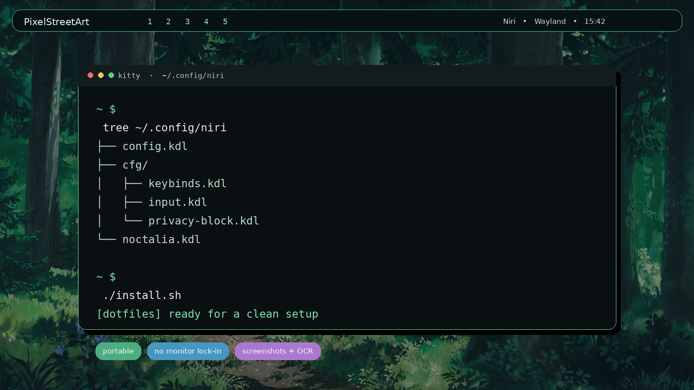
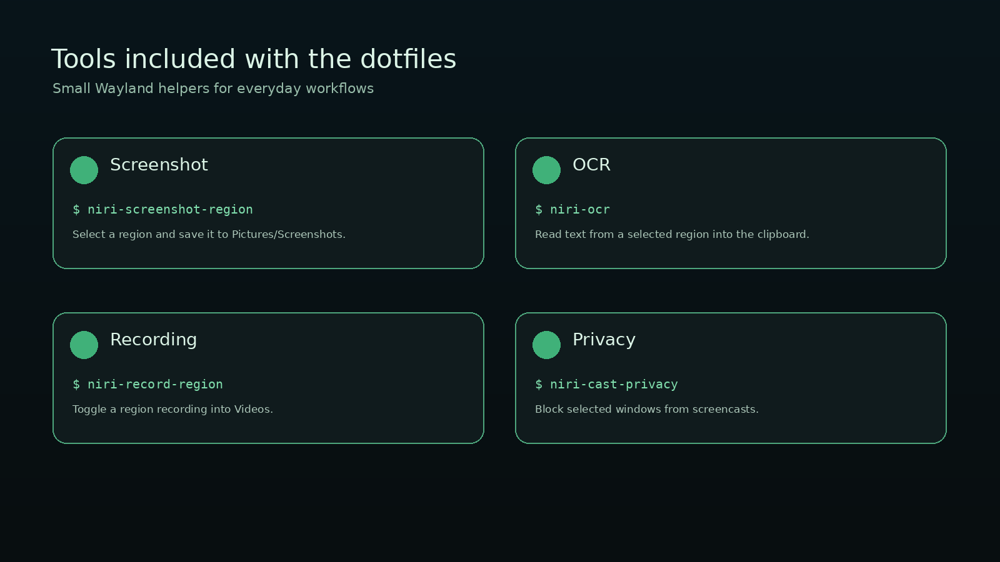

# PixelStreetArt Niri Dotfiles

Portable CachyOS/Niri dotfiles with a dark pixel-inspired look, practical keybindings, and small Wayland helpers for screenshots, recording, OCR, privacy, and voice input.



## What is included

- Niri configuration split into small, readable KDL files.
- Optional Noctalia Shell integration.
- Kitty, Alacritty, Foot, GTK, Fastfetch, and icon theme configuration.
- Region screenshots, screen recording, OCR, and screencast privacy tools.
- Optional package lists for Arch-based systems.
- Automatic backups when existing files are replaced.

The configuration is intentionally portable. It does not include monitor names, resolutions, refresh rates, positions, mouse sensitivity, cursor preferences, GPU driver variables, or desktop runtime state.

## Preview



These are repository preview mockups made from the included visual style and configuration. They are not screenshots of a specific user's desktop.

## Requirements

- Arch Linux or CachyOS
- Niri
- Wayland session
- `git`

The optional helper scripts may also use:

- `grim` and `slurp` for screenshots
- `wf-recorder` for recording
- `tesseract` and `wl-clipboard` for OCR
- Python GTK, Cairo, and GtkLayerShell bindings for the overlay tools
- A separately installed `voxtype` binary for voice input

## Installation

Clone the repository and run the installer:

```bash
git clone https://github.com/MixaDoDs/PixelStreetArt_Dotfiles_Niri.git
cd PixelStreetArt_Dotfiles_Niri
./install.sh
```

The installer asks which profile to use:

- `full` — desktop styling, Noctalia integration, and wallpapers.
- `tech` — a smaller setup without Noctalia-specific configuration.

To install configuration files without the package step:

```bash
DOTFILES_MODE=tech SKIP_PACKAGES=1 ./install.sh
```

Existing files are backed up as:

```text
filename.bak.YYYYMMDD-HHMMSS
```

## After installation

Review these files and adjust them for your system:

```text
~/.config/niri/cfg/keybinds.kdl
~/.config/niri/cfg/keybinds-no-noctalia.kdl
~/.config/niri/cfg/misc.kdl
```

The default keybindings expect `kitty`, `helium-browser`, `nautilus`, and several Wayland utilities. Replace those commands if you use different applications.

Monitor output blocks are deliberately omitted. Configure outputs through your system or add local `output` blocks to your own Niri configuration.

## Helper commands

| Command | Purpose |
| --- | --- |
| `niri-screenshot-region` | Select and save a screenshot region |
| `niri-record-region` | Toggle recording of a selected region |
| `niri-ocr` | Copy text from a selected region |
| `niri-cast-privacy` | Hide selected application windows from screencasts |
| `voxtype-indicator` | Show the voice input indicator |

The scripts are installed into `~/.local/bin`.

## Repository layout

```text
.config/          Application and Niri configuration
.local/bin/       Wayland helper scripts
.local/share/     Optional icon and font assets
Pictures/         Optional wallpapers
packages/         Arch, AUR, and Flatpak package lists
docs/screenshots/ README preview images
install.sh        Installer with backups and profiles
```

## Notes

- No credentials, browser profiles, history, caches, or local runtime state are included.
- Wallpapers are optional and can be removed without affecting the configuration.
- The included `pixora` icon theme and pixel font are optional visual assets.
- Niri configuration syntax can change between releases; check the current Niri documentation if a config option is rejected.

## License

No license file is currently included. Add one before redistributing the repository under a specific license.
