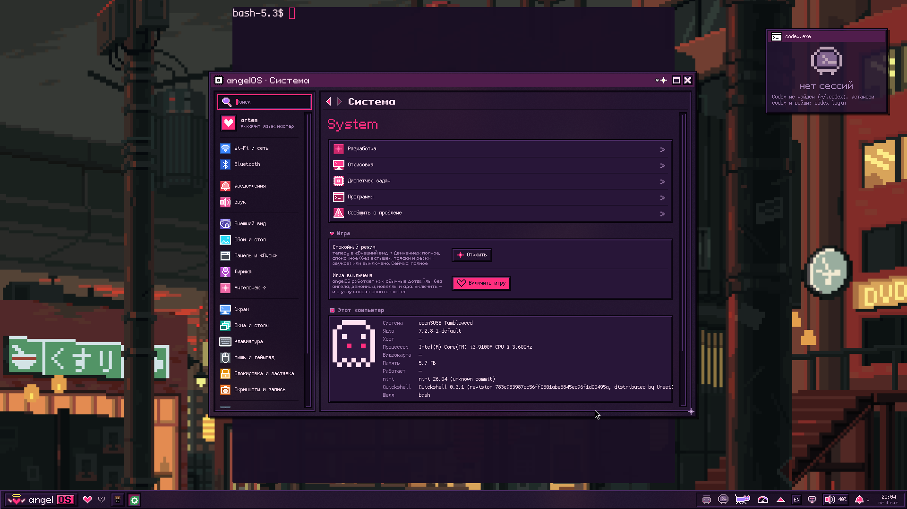
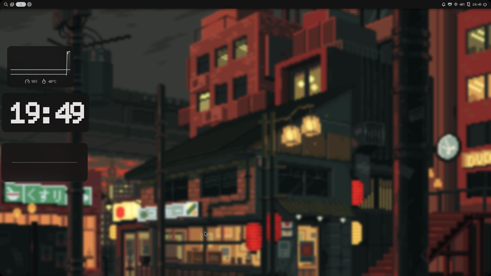

# Результаты проверки порта

Дата: 4 октября 2026 года, Asia/Vladivostok. Среда: openSUSE Tumbleweed `20261002`, VirtualBox, 2 CPU, около 6 ГБ RAM, графика VMSVGA. Версии: Niri `26.04`, Quickshell `0.3.1`, Noctalia `5.2.1`, kernel-default `7.2.8`.

| Проверка | Результат |
| --- | --- |
| Установка AngelOS и установка обеих оболочек | Успешно |
| Установка с `DESKTOP_SHELL=noctalia` | Успешно |
| Решатель zypper, весь набор пакетов обеих оболочек, SDDM, tools, русский OCR | Dry-run завершён с кодом 0, ничего не требуется устанавливать |
| `REQUIRE_UI=1 bash scripts/check.sh` | Все проверки прошли, код 0 |
| Синтаксис shell/Python, ShellCheck | Успешно |
| Обе конфигурации Niri | Валидны |
| Конфигурация Noctalia | Валидна без предупреждений |
| Повторная установка, сохранение изменённых конфигов, настройки монитора | Успешно |
| Неудачное обновление, восстановление, конфликты пользовательских изменений | Успешно |
| Существующий CLI `angelos` и drop-in SDDM | Отдельно проверено сохранение исходных файлов в `.bak.*` |
| Расширенный UI-тест AngelOS | Прошёл, код 0; страницы настроек, эффекты, Undo, игровые сценарии, экспорт тем, матрица масштабов |
| Вход через SDDM → Niri | Успешно, обычная аутентификация пользователя; autologin не включался |
| `angelos switch noctalia` и обратно | Обе оболочки запускаются; конфиг Niri валиден после переключений |
| Launcher, Kitty, настройки и буфер обмена | Проверены в живой графической сессии |
| Разрешение гостевой ВМ | 1920×1080, сохранено только в гостевом `monitor.kdl` |

Полный UI-тест выполнялся на фиксированной копии исходников. В минимальной ВМ без swap параллельные UI-прогоны вызвали OOM; итоговый одиночный прогон получил временный резерв swap 4 ГБ и увеличенный лимит времени. Временный swap после проверки удалён. Это условия стресс-теста, а не требование выделять 4 ГБ swap установщику.

В исходном образе были `kernel-default-base` без драйвера `vmwgfx` и отсутствовала `libwayland-server0`. Первое ограничивало графику VESA, второе приводило к падению Niri при входе, хотя `niri validate` проходил. Порт обрабатывает оба случая. Также исправлены резервное копирование заменяемого CLI/SDDM drop-in, снимки gsettings при обновлении и проверка Undo при заполненной истории из 40 записей.

## Границы проверки

Физический GPU, NVIDIA и сборка его дополнительного Qt EGL плагина, Wi-Fi/Bluetooth с реальными устройствами, сон/пробуждение и несколько мониторов не проверялись. Voxtype, большая модель диктовки, дополнительные подборки обоев и установка Flatpak-приложений были отключены при тестовой установке. Успешная ВМ не гарантирует работу всего этого на любом компьютере.

GitHub Actions настроен для Tumbleweed, но результат удалённого CI нужно проверять после публикации. Локальные успешные прогоны не являются результатом GitHub Actions.

Система хоста не использовалась для установки или исполнения dotfiles. На хосте сохранены только исходники, Git-коммиты, скриншоты и результаты работы в папке проекта. До изменений гостя сохранены важный Snapper-снимок 11 и отдельный архив домашней папки.
